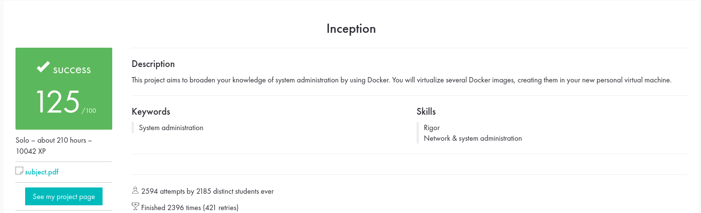

# Inception

A mini infrastructure project built using Docker Compose as part of the 42 Cursus.
This project simulates a small-scale web stack including WordPress, MariaDB, NGINX, and optional bonus services, all running in isolated Docker containers with proper networking, volumes, and secure configurations.

---

## Features
Mandatory Setup
+ NGINX: Runs in a dedicated container as the sole entry point, with TLSv1.2 or TLSv1.3 enabled.
+ WordPress: Runs with php-fpm only (no NGINX), in its own container.
+ MariaDB: Dedicated container for the database, with two users pre-configured.
+ Volumes:
    + WordPress database stored in a persistent volume
    + WordPress website files stored in a separate persistent volume
+ Networking: Custom Docker network connecting all services
+ Resilience: Containers automatically restart on crash
+ Environment Variables & Secrets: All sensitive info stored in .env and Docker secrets
+ No hacky loops: Containers follow best practices (no tail -f, while true, or infinite loops)

Bonus Features
+ Redis cache: Optimized WordPress performance
+ FTP server: Accessible container pointing to WordPress files volume
+ Static website: Simple site in non-PHP language
+ Adminer: Database management tool
+ Additional service: Custom service of choice demonstrating flexibility, for which I chose Portrainer
---

## Project Structure

```
.
├── Makefile
├── README.md
└── srcs
    ├── docker-compose.yml
    └── requirements
        ├── bonus/
        ├── mariadb/
        ├── nginx/
        └── wordpress/
```

---

## Installation

### Clone and build
```bash
git clone https://github.com/ngaurama/inception.git
cd inception/srcs
make
```
This builds all Docker images and starts the infrastructure with docker-compose up.

### Access
+ WordPress: https://ngaurama.42.fr (has to be pre-configured in /etc/hosts as a proxy)
+ FTP (bonus): access WordPress files via any client
+ Adminer (bonus): manage MariaDB via https://ngaurama.42.fr/adminer
+ Portrainer (bonus): manage MariaDB via https://ngaurama.42.fr/portrainer
+ Static website (bonus): manage MariaDB via https://ngaurama.42.fr/portfolio
    + For a more better explanation/website, please take a look at this repo: https://github.com/ngaurama/Portfolio

---
### Learning Outcomes
Through this project, I gained experience with:
+ Writing Dockerfiles and Docker Compose configurations for multi-container setups
+ Isolating services in dedicated containers with custom networking and volumes
+ Configuring NGINX and secure routing
+ Setting up WordPress with php-fpm and MariaDB database users
+ Managing environment variables and Docker secrets for sensitive data
---

### Evaluation


---
## Author
+ Nitai Gauramani
  - 42 Paris – Common Core project <br>


